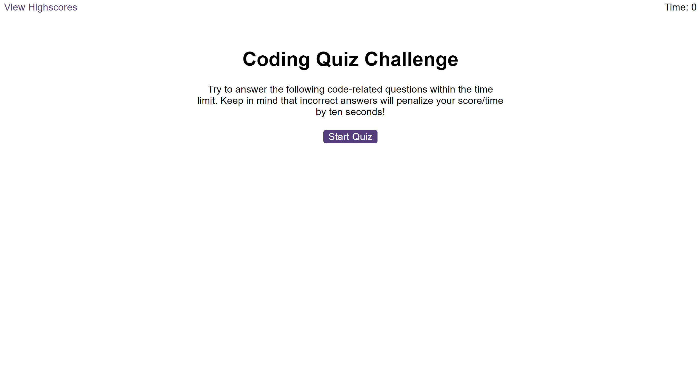
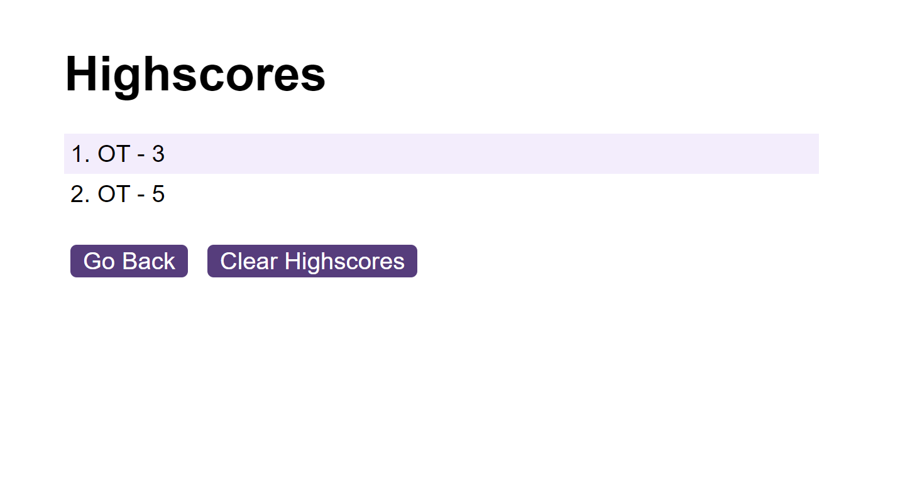

# Code Quiz - OT

## Description 

### User Story

```
AS A coding boot camp students 
I WANT to take a timed quiz on JavaScript fundamentals that stores high scores
SO THAT I can gauge my progress compared to my peers
```

### Acceptance Criteria

```
* The JavaScript code quiz web application starts the timer and displays the first question on click of a start button.

* The questions contain buttons for each answer.

* The next question is displayed when an answer button is clicked.

* Clicking an incorrect answer results in time being substracted from the clock.

* The quiz must end when all questions are answered or the timer reaches zero.

* Player's score is displayed at the end of the game with the option to save it with their initials.

* Player's score can also view their highscores.

```

## Table of Contents

* [Description](#description)
* [Usage](#usage)
* [Credits](#credits)
* [License](#license)

## Usage 

### Deployed Application

* The URL of the deployed application:
[https://thorbieey.github.io/Code-Quiz-OT/](https://thorbieey.github.io/Code-Quiz-OT/)

* The URL of the GitHub repository: 
[https://github.com/Thorbieey/Code-Quiz-OT.git](https://github.com/Thorbieey/Code-Quiz-OT.git)

### Screenshot

Below are demos showing the web application's appearance and functionality




## Credits

* [Learn about setting the value of an elements attribute](https://developer.mozilla.org/en-US/docs/Web/API/Element/setAttribute)
* [View sample JavaScript quiz questions](https://raw.githubusercontent.com/Ebazhanov/linkedin-skill-assessments-quizzes/main/javascript/javascript-quiz.md)
* [Learn about storing data on user-end: **local storage**](https://developer.mozilla.org/en-US/docs/Web/API/Window/localStorage)
* [Learn about string method: **slice()**](https://developer.mozilla.org/en-US/docs/Web/JavaScript/Reference/Global_Objects/String/slice)
* [Meet document method: **querySelector**](https://developer.mozilla.org/en-US/docs/Web/API/Document/querySelector)
* Wanna check out cool options for adding audio effects to your page? [**Stack Overflow** has you covered.](https://stackoverflow.com/questions/9419263/how-to-play-audio)

## License

Licensed under the [MIT](https://choosealicense.com/licenses/mit/) license